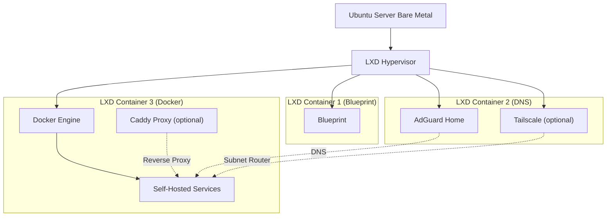

# Homelab Runbooks

This repository provides a step-by-step blueprint for building a high-performance homelab. While the instructions are optimised for the Raspberry Pi 5 (where 16GB of RAM provides more than enough power for this entire stack), the architecture is platform-agnostic and compatible with any machine capable of running Ubuntu Server. Unlike appliance-style images, this project focuses on runbooks – repeatable, human-readable instructions that give you full control over every layer of your stack.
## Why Runbooks?
Most homelab tutorials are either too simple (one-command installers) or too complex (full automation scripts you don’t understand). These runbooks sit right in the middle:
1. **Isolation First**: You use LXD containers to keep the host clean. Your Docker workloads stay in their own “room”, and your DNS/VPN stays in another.
2. **No Blind Copy-Paste**: Every command is explained. You use placeholders (like `<HOST_LAN_IP>`) to adapt the instructions to your real network before you even touch the terminal.
3. **Reproducibility**: If you ever need to rebuild, you just follow the same runbook. It’s documentation-as-code for humans.
## Architecture Overview

## How to Read these Runbooks
1. **Open the [Homelab Guide](Runbooks/Homelab%20Guide.md "Homelab Guide")**: This is your master reference.
2. **Identify Placeholders**: Look for bracketed values like `<HOST_LAN_IP>`.
3. **Fill the Table**: The [Homelab Guide](Runbooks/Homelab%20Guide.md#placeholders "Homelab Guide") has a table where you can map these placeholders to your actual network values.
4. **Execute & Validate**: Each runbook has a **Verification** section. If the verification fails, do not proceed to the next step.
## Prerequisites
- **Hardware**: Though a Raspberry Pi 5 with 16GB RAM is highly recommended for its efficiency and more than sufficient performance for this stack, any x86 or ARM64 machine running Ubuntu Server will suffice.
- **Skills**: Comfort with SSH and basic Linux commands.
- **Mindset**: You prefer understanding your system over “one-click” solutions.
## Roadmap
The goal is to evolve the initial stable foundation into a fully monitored, self-maintaining, and cloud-capable infrastructure.
### v1.0.0 – Stable Foundation (Current)
- Core LXD infrastructure on Raspberry Pi.
- Isolated DNS (AdGuard Home) and Docker environments.
- Secure baseline networking (UFW, Netplan).
- Optional modules for NVMe, Tailscale, and Caddy.
### v1.1.0 – Security & Hardening
*Focus: Transitioning from a stable to a hardened environment.*
- **SSH Hardening**: Key-only authentication, port change, and root login disabling.
- **Automated Security**: Unattended Upgrades for hands-off security patching.
### v1.2.0 – Maintenance & Recovery
*Focus: Long-term reliability and disaster recovery.*
- **Disaster Recovery**: Refined backup strategies for NVMe-to-SD card recovery.
- **Host Integrity**: Regular health checks and snapshot management.
### v1.3.0 – Monitoring & Alerts
*Focus: System visibility and proactive status reporting.*
- **Server Dashboard**: Cockpit for a web-based overview of performance.
- **Alerting**: Push notifications for system events and service status via ntfy.
### v1.4.0 – Network Storage
*Focus: Local file sharing for cross-device access.*
- **Samba Integration**: Network storage for easy file access across the LAN.
### v1.5.0 – Personal Cloud
*Focus: Transforming the homelab into a functional private cloud.*
- **Nextcloud AIO**: Personal cloud infrastructure within the LXD/Docker ecosystem.
## Contributing
[Contributions are welcome!](CONTRIBUTING.md "Contributions are welcome!")
## Licence
This project uses the [MIT Licence](LICENCE "MIT Licence"). You may use, change, and distribute it in compliance with the licence terms.